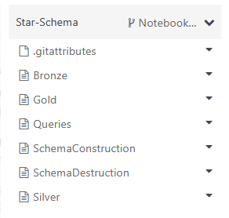
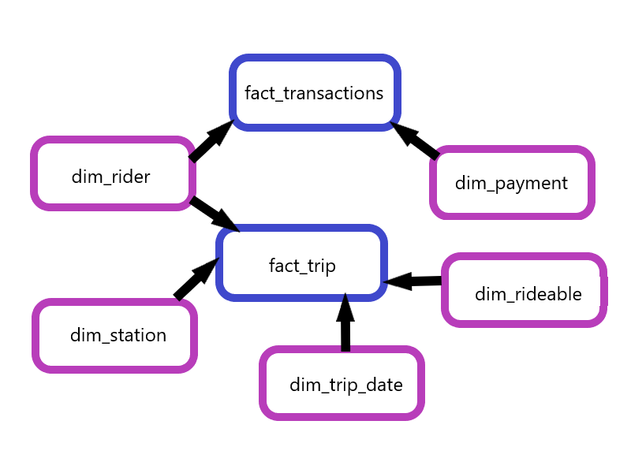
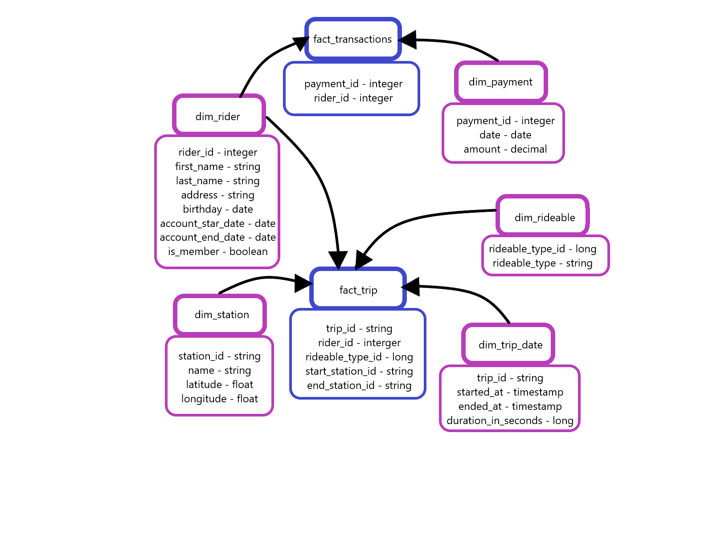
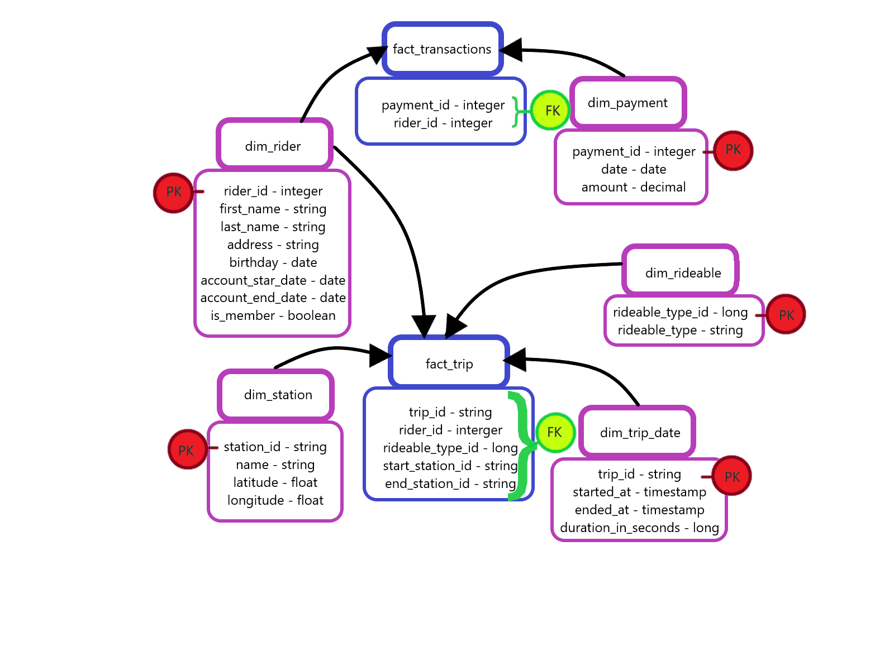
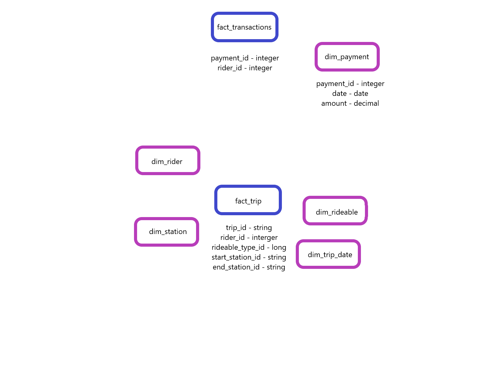
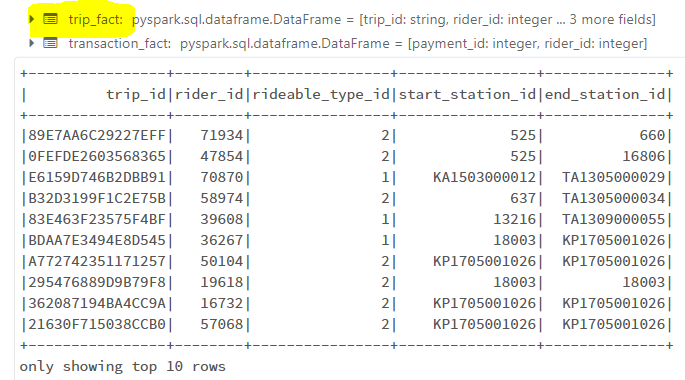
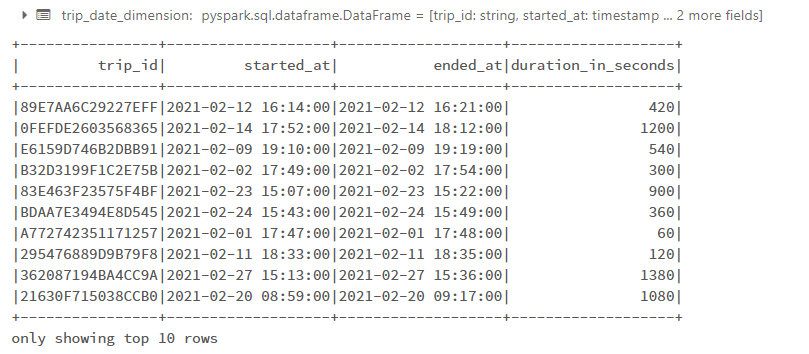
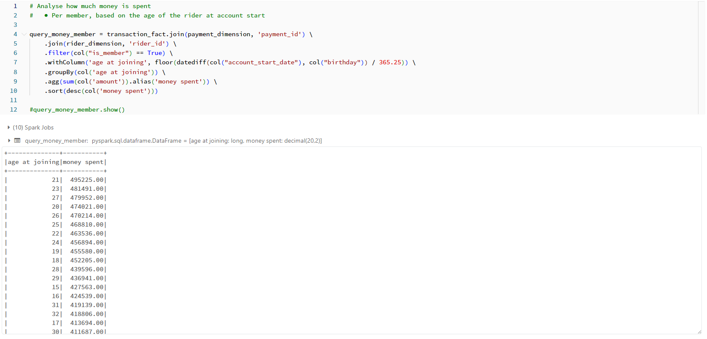
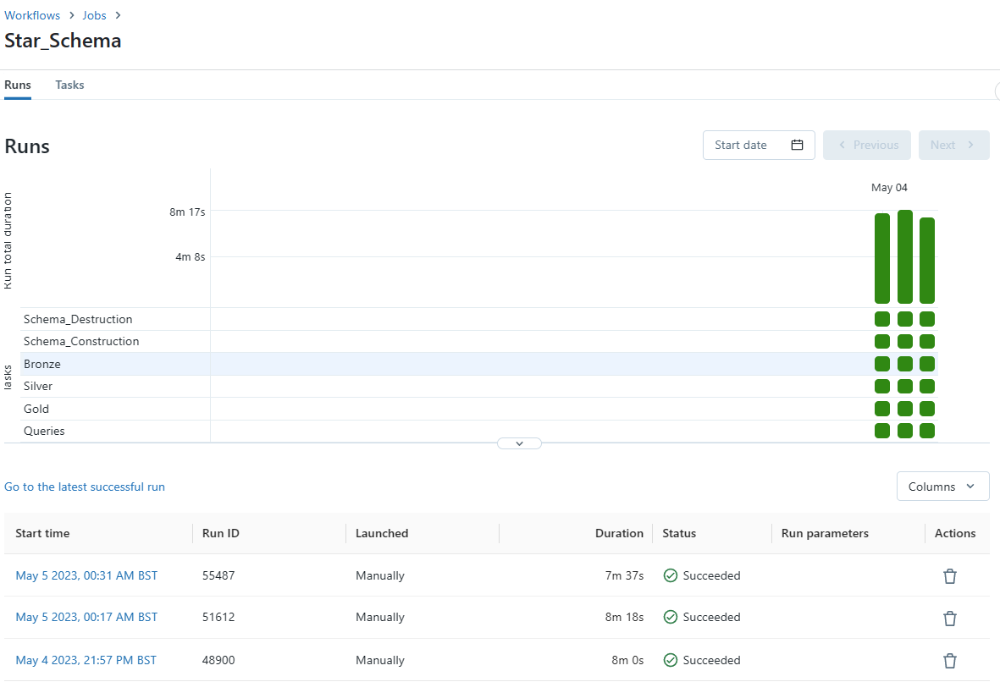

# Star-Schema
Data lake solution for bikeshare

Peace and Blessings. 
This project utilises raw data from a bike sharing program, converts and manipulates the data into a star schema format with 2 fact tables and 5 dimension tables. The star schema format is optimal for executing queries for business analysis at the cost of some data redundancy.
This project is designed to be imported into databricks and executed via a workflow.

 Notebooks Snippet 

# Design

 Visual Database Designs 

Conceptual Database Design

Logical Database Design

Physical Database Design

# Implementation

There are six notebooks in the databricks workflow and four csvs in this repository
SchemaDestruction - Functions as a reset by destroying the folder any old data/schemas/tables may be located in.
SchemaConstruction - Builds the schemas and dataframes that the raw data will be transfered to in and writes the directories and blank tables that store the processed data.
Bronze, Silver, Gold - Combine to implement the Medallion Architecture through ingesting, cleansing, manipulating and transforming the data into the desired format.
Queries - Has example business questions that a user may request and additionally has testing methods to assert that the data has been processed correctly.

Example Queries:

1) Total time spent riding based on specific dates
2) Total time spent riding by the hour
3) Total time spent riding by the day of the week
4) Total time spent riding by departure station
5) Total time spent riding by arrival station
6) Total time spent riding by departure and arrival station
7) Total time spent riding based on age of rider
8) Total time spent riding based on age of riders who are members
9) Total money spent per month
10) Total money spent per year
11) Total money spent per quarter
12) Total money spent by members based on age of rider when they became a member

# Evidence 

Please see below images of various aspects of the project:

 DBFS Directory Layout 

 Fact Table 

 Dimension Table 

 Example Query 

 Workflow 

